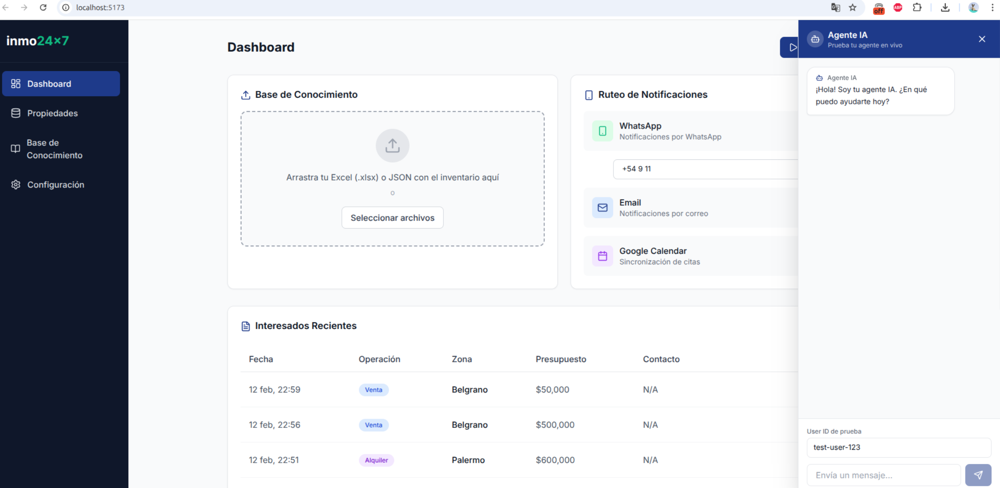

# Inmo24x7 Backoffice

Backoffice moderno para la gestión de leads y configuración del agente IA inmo24x7.

<div align="center">



</div>

## 🚀 Tecnologías

- **React 18** - Framework UI
- **Vite** - Build tool
- **Tailwind CSS** - Estilos
- **Supabase Auth** - Autenticación
- **Axios** - Cliente HTTP
- **Lucide React** - Iconos

## 📁 Estructura del Proyecto

```
inmo24x7-backoffice/
├── src/
│   ├── assets/              # Recursos estáticos
│   ├── components/          # Componentes reutilizables
│   │   ├── Sidebar.jsx
│   │   ├── Layout.jsx
│   │   └── ChatSimulator.jsx
│   ├── pages/               # Páginas principales
│   │   ├── Dashboard.jsx
│   │   └── Login.jsx
│   ├── services/            # Servicios de API
│   │   ├── supabaseClient.js
│   │   └── api.js
│   ├── App.jsx              # Router y rutas
│   ├── main.jsx             # Entry point
│   └── index.css            # Estilos globales
├── .env                     # Variables de entorno
├── tailwind.config.js       # Configuración Tailwind
└── package.json
```

## ⚙️ Configuración

1. **Clonar y instalar dependencias:**
```bash
npm install
```

2. **Configurar variables de entorno:**
Copia el archivo `.env` y completa tus credenciales:

```env
VITE_SUPABASE_URL=tu_supabase_url
VITE_SUPABASE_ANON_KEY=tu_supabase_anon_key
VITE_USE_SUPABASE_AUTH=false  # "true" para habilitar auth, "false" para deshabilitar
VITE_API_URL=http://localhost:3000
```

### 🔐 Autenticación Configurable

La autenticación con Supabase puede habilitarse/deshabilitarse mediante la variable `VITE_USE_SUPABASE_AUTH`:

- **`VITE_USE_SUPABASE_AUTH=false`** (default): Acceso libre sin login. Las rutas protegidas están abiertas.
- **`VITE_USE_SUPABASE_AUTH=true`**: Requiere login con Supabase Auth para acceder al dashboard.

3. **Iniciar servidor de desarrollo:**
```bash
npm run dev
```

## 🎨 Paleta de Colores

- **Brand Blue:** `#1E3A8A` - Color principal
- **Brand Green:** `#10B981` - Acentos y éxito

## 🔐 Autenticación

El sistema usa Supabase Auth con las siguientes características:
- Login con email y contraseña
- Rutas protegidas
- Persistencia de sesión
- Logout

## 📊 Funcionalidades

### Dashboard
- **Gestión de Leads:** Tabla con listado, filtros y eliminación
- **Base de Conocimiento:** Drag & drop de archivos Excel/JSON
- **Configuración de Notificaciones:** Toggles para WhatsApp, Email y Calendar
- **Simulador de Chat:** Panel lateral para probar el agente IA

### Endpoints API

```
GET    /api/leads          # Listar leads
DELETE /api/leads/:id      # Eliminar lead
POST   /message            # Enviar mensaje al bot
```

## 🛠️ Comandos

```bash
npm run dev      # Iniciar servidor de desarrollo
npm run build    # Compilar para producción
npm run preview  # Previsualizar build de producción
npm run lint     # Ejecutar linter
```

## 🐳 Docker Deployment

### Construir imagen localmente:

```bash
# Opción 1: Con build-args explícitos
docker build \
  --build-arg VITE_SUPABASE_URL=https://your-project.supabase.co \
  --build-arg VITE_SUPABASE_ANON_KEY=your-anon-key \
  --build-arg VITE_API_URL=http://localhost:3000 \
  --build-arg VITE_USE_SUPABASE_AUTH=false \
  -t inmo24x7-backoffice .

# Opción 2: Usando archivo .env
docker build --build-arg $(cat .env | xargs) -t inmo24x7-backoffice .
```

### Ejecutar contenedor:

```bash
docker run -p 80:80 inmo24x7-backoffice
```

La aplicación estará disponible en `http://localhost`

### Docker Compose:

```bash
# Crear archivo .env con las variables
nano .env

# Ejecutar con Docker Compose
docker-compose up -d
```

## 🚀 CI/CD - GitHub Actions + Digital Ocean

El proyecto incluye un workflow de GitHub Actions que:
1. Compila la aplicación con las variables de entorno
2. Crea una imagen Docker
3. Publica en GitHub Container Registry (ghcr.io)
4. **Deploy manual en Digital Ocean** (requiere aprobación)

### Configuración:

1. Ve a **Settings > Secrets and variables > Actions** en tu repo de GitHub
2. Agrega estos secrets:
   - `VITE_SUPABASE_URL`
   - `VITE_SUPABASE_ANON_KEY`
   - `VITE_API_URL`
   - `VITE_USE_SUPABASE_AUTH`
   - `DIGITALOCEAN_HOST` (IP o dominio de tu droplet)
   - `DIGITALOCEAN_SSH_KEY` (clave SSH privada para conexión)
   - `DIGITALOCEAN_USER` (usuario SSH, típicamente `root`)

### Uso:

El workflow se ejecuta automáticamente en cada push a `main`. Una vez que el build es exitoso, podrás ver una notificación en GitHub para **aprobar el deployment manual** en Digital Ocean.

Para desplegar manualmente desde GitHub:
1. Ve a la pestaña **Actions** en tu repo
2. Selecciona el workflow **"Build and Deploy to Digital Ocean"**
3. Haz clic en **"Run workflow"**
4. Selecciona la rama (usualmente `main`)
5. El workflow hará el build y esperará tu aprobación para el deploy
6. Revisa el build y haz clic en **"Approve"** para desplegar en Digital Ocean

## 📄 Licencia

Proyecto privado - Inmo24x7
