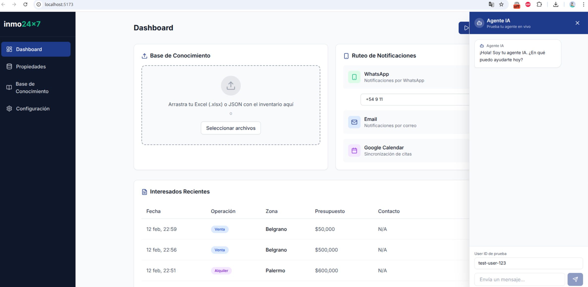

# Inmo24x7 Backoffice

Backoffice multi-tenant para administración global (admin) y operación por tenant.

<div align="center">



</div>

## 🚀 Tecnologías

- **React 18** - Framework UI
- **Vite** - Build tool
- **Tailwind CSS** - Estilos
- **Supabase Auth** - Autenticación
- **Axios** - Cliente HTTP
- **Lucide React** - Iconos

## 📁 Estructura del Proyecto

```
inmo24x7-backoffice/
├── src/
│   ├── assets/              # Recursos estáticos
│   ├── components/          # Componentes reutilizables
│   │   ├── Sidebar.jsx
│   │   ├── Layout.jsx
│   │   └── ChatSimulator.jsx
│   ├── pages/               # Páginas principales
│   │   ├── Login.jsx
│   │   ├── AdminTenants.jsx
│   │   ├── AdminTenantCreate.jsx
│   │   ├── AdminLeads.jsx
│   │   ├── AdminProperties.jsx
│   │   ├── TenantLeads.jsx
│   │   ├── TenantProperties.jsx
│   │   └── TenantNotifications.jsx
│   ├── services/            # Servicios de API
│   │   ├── supabaseClient.js
│   │   ├── api.js
│   │   ├── adminApi.js
│   │   └── tenantApi.js
│   ├── App.jsx              # Router y rutas
│   ├── main.jsx             # Entry point
│   └── index.css            # Estilos globales
├── .env                     # Variables de entorno
├── tailwind.config.js       # Configuración Tailwind
└── package.json
```

## ⚙️ Configuración

1. **Clonar y instalar dependencias:**
```bash
npm install
```

2. **Configurar variables de entorno:**
Copia el archivo `.env` y completa tus credenciales:

```env
VITE_SUPABASE_URL=tu_supabase_url
VITE_SUPABASE_ANON_KEY=tu_supabase_anon_key
VITE_USE_SUPABASE_AUTH=false  # "true" para habilitar auth, "false" para deshabilitar
VITE_API_URL=http://localhost:3000
```

### 🔐 Autenticación Configurable

La autenticación con Supabase puede habilitarse/deshabilitarse mediante la variable `VITE_USE_SUPABASE_AUTH`:

- **`VITE_USE_SUPABASE_AUTH=false`** (default): Acceso libre sin login. Las rutas protegidas están abiertas.
- **`VITE_USE_SUPABASE_AUTH=true`**: Requiere login con Supabase Auth para acceder al dashboard.

3. **Iniciar servidor de desarrollo:**
```bash
npm run dev
```

## 🎨 Paleta de Colores

- **Brand Blue:** `#1E3A8A` - Color principal
- **Brand Green:** `#10B981` - Acentos y éxito

## 🔐 Autenticación

El sistema usa Supabase Auth con las siguientes características:
- Login con email y contraseña
- Rutas protegidas
- Persistencia de sesión
- Logout

## 📊 Funcionalidades

### Admin
- Home admin con simulador de chatbot y selector de tenant
- Crear tenant + owner desde onboarding
- Listar tenants con paginación
- Habilitar/deshabilitar tenant
- Eliminar tenant (con errores claros si está bloqueado por datos relacionados)
- Gestionar canales por tenant (email / WhatsApp)
- Ver leads y properties globales con paginación y filtro por tenant
- Importar propiedades por archivo JSON para un tenant seleccionado
- Eliminar propiedades en lote desde la grilla de propiedades

### Tenant
- Ver leads paginados
- Ver properties paginadas
- Gestionar canales de notificación propios
- Importar propiedades por JSON para su propio tenant

### Endpoints API

```
POST   /admin/onboard                     # Onboarding tenant + owner
GET    /admin/tenants                     # Tenants paginados
PATCH  /admin/tenants/:id/status          # Enable/disable
DELETE /admin/tenants/:id                 # Delete guarded
GET    /admin/tenants/:id/channels        # Listar canales de tenant
POST   /admin/tenants/:id/channels        # Crear canal de tenant
PATCH  /admin/channels/:channelId         # Actualizar canal
GET    /api/leads                         # Leads paginados
GET    /api/properties                    # Properties paginadas
POST   /api/properties/import-json        # Importar properties por JSON
DELETE /api/properties/:id                # Eliminar property
GET    /api/tenant/channels               # Canales del tenant autenticado
POST   /api/tenant/channels               # Crear canal del tenant
PATCH  /api/tenant/channels/:channelId    # Actualizar canal del tenant
```

## 🛠️ Comandos

```bash
npm run dev      # Iniciar servidor de desarrollo
npm run build    # Compilar para producción
npm run test      # Ejecutar tests en modo watch
npm run test:run  # Ejecutar tests una vez (CI)
npm run preview  # Previsualizar build de producción
npm run lint     # Ejecutar linter
```

## ✅ Tests

El proyecto incluye unit tests para componentes en `src/components` con Vitest + Testing Library.

```bash
npm install
npm run test:run
```

En CI/CD, el workflow de deploy ejecuta tests antes del build de Docker; si fallan, no se publica imagen.

## 🐳 Docker Deployment

### Construir imagen localmente:

```bash
# Opción 1: Con build-args explícitos
docker build \
  --build-arg VITE_SUPABASE_URL=https://your-project.supabase.co \
  --build-arg VITE_SUPABASE_ANON_KEY=your-anon-key \
  --build-arg VITE_API_URL=http://localhost:3000 \
  --build-arg VITE_USE_SUPABASE_AUTH=false \
  -t inmo24x7-backoffice .

# Opción 2: Usando archivo .env
docker build --build-arg $(cat .env | xargs) -t inmo24x7-backoffice .
```

### Ejecutar contenedor:

```bash
docker run -p 80:80 inmo24x7-backoffice
```

La aplicación estará disponible en `http://localhost`

### Docker Compose:

```bash
# Crear archivo .env con las variables
nano .env

# Ejecutar con Docker Compose
docker-compose up -d
```

## 🚀 CI/CD - GitHub Actions + Digital Ocean

El proyecto incluye un workflow de GitHub Actions que:
1. Compila la aplicación con las variables de entorno
2. Crea una imagen Docker
3. Publica en GitHub Container Registry (ghcr.io)
4. **Deploy manual en Digital Ocean** (requiere aprobación)

### Configuración:

1. Ve a **Settings > Secrets and variables > Actions** en tu repo de GitHub
2. Agrega estos secrets:
   - `VITE_SUPABASE_URL`
   - `VITE_SUPABASE_ANON_KEY`
   - `VITE_API_URL`
   - `VITE_USE_SUPABASE_AUTH`
   - `DIGITALOCEAN_HOST` (IP o dominio de tu droplet)
   - `DIGITALOCEAN_SSH_KEY` (clave SSH privada para conexión)
   - `DIGITALOCEAN_USER` (usuario SSH, típicamente `root`)

### Uso:

El workflow se ejecuta automáticamente en cada push a `main`. Una vez que el build es exitoso, podrás ver una notificación en GitHub para **aprobar el deployment manual** en Digital Ocean.

Para desplegar manualmente desde GitHub:
1. Ve a la pestaña **Actions** en tu repo
2. Selecciona el workflow **"Build and Deploy to Digital Ocean"**
3. Haz clic en **"Run workflow"**
4. Selecciona la rama (usualmente `main`)
5. El workflow hará el build y esperará tu aprobación para el deploy
6. Revisa el build y haz clic en **"Approve"** para desplegar en Digital Ocean

## 📄 Licencia

Proyecto privado - Inmo24x7
